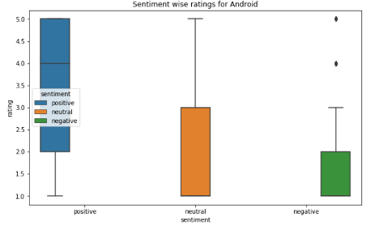

# Comparing-app-ratings-and-reviews-in-iOS-and-Android

<h2>Introduction

We focused our attention on apps that were available on the Apple app store and Google Play store. Our objective was to compare apps on both the platforms, and bring out any differences in how users perceive these apps. App stores provide us with a wealth of user information on apps, primarily user reviews and ratings. This feedback is essential in understanding what the user wants and thinks; if this feedback is well utilised, it would be in favor of both the user and the app creator.
Hence the comparison of the ratings and reviews of apps that are deployed in both the Apple App Store and the Google Play Market could be beneficial to understand similar or different trends.
Our analysis was based on the comparison of two factors :
1. Ratings

    - Analyzing the ratings was based on the numerical value of each app’s rating. An application’s rating can affect its success and visibility in many ways:
    - Good ratings indicate that your app provides benefits to its users. This will convince new users to download your app.
    - A poor app rating will achieve the opposite effect, chasing users away from your app.
    - Your app’s rating will affect its chances of being featured. Apps with 3 stars or lower might not be featured.
    - The app rating is an important aspect of App Store Optimization (ASO).
    - Negative mobile app reviews combined with a poor rating will hurt your app’s rank, but great app reviews and high ratings will help increase your app’s rank.

2. Reviews:

    - Analyzing the reviews, involved downloading reviews and doing a coarse natural language processing of the reviews.
    - According to Mobile Action, more than 75% of users read at least one review before downloading the app, to confirm if it will be a good experience.
    - Taking care of the user sentiment, listening to your users and providing the best possible user experience possible is a key to having a high level of user engagement for your product. The users will not only install the application, but also access it and use it often. If you achieve this, it will mean that your app is well received, and it would potentially mean more success for the
application.
    - Knowing the correlation between ratings and reviews can help understand whether a high rating also means a good review or not.

<h2> Data Collection

Number of apps considered: 80
- As the affordability of smartphones across the world is increasing exponentially, the app industry has absolutely exploded in the last 3 years.
- This is roughly how many apps you’ll find in the Google Play Store and the Apple App Store:
- Android apps: 2.7 million
- iOS apps: 2.2 million
- Traditionally, iOS has been a more lucrative platform for developers, so there has been a
tendency for new apps to appear there first, but that is changing as Android’s market share
continues to grow.
- In the U.S., iOS still leads the way, but developers elsewhere are increasingly targeting
Android first. The Play Store still has a higher percentage of free apps than the App Store.

Our study included different categories of apps separately in the study, namely:
- Social
- Games
- Health & Fitness
- Travel
- Utility
- Education
- LifeStyle

The choice of these categories was driven by our perceived importance of these categories. Within each category, we selected the top 10-12 most popular and free apps from each category that were deployed on both the Apple App Store and Google Play Store. Presumably, the policy for popularity for both apps is according to the number of downloads, and we used this to pick our initial sample of applications.

<h2>Scrapers

- Initially researched on Kaggle, in order to get the datasets according to the requirements.
-  As we proceeded, we decided not to continue with them, because we could not find a dataset with all the features we wanted. A dataset which had individual reviews and ratings
could not be found, so we decided to use custom web scraping tools.
- We made minor changes to the API’s to suit our format and needs, and the links to the scraper can be found in our references. The Android scraper[2] we used was written in Python, while the iOS scraper[3] was based on node.js. in order to get the particular format required for our analysis.
- The API’s fetched the data by the unique application Id, which we had to put manually.

<h2> Data Analysis

Initially, we analyzed the trend in ratings for the app data that we collected for both platforms. The results are as follows:

         

The above data classifies the observations into the different classes of ratings. 

We then analyzed the ratings from the collected data, across seven categories on Android and iOS platforms. The results are as follows:

 

<h2> Prediction Model

The relationship between user reviews and user ratings is an important motivating factor for this prediction task. Understanding this relationship can help us understand human behaviour and how their sentiments affect the ratings. The project uses a dataset discussed earlier, 7873 android reviews and 3901 ios reviews with which we train 2 different models. We use TruncatedSVD to reduce the dimensionality and extract key features. We can either address the problem using a Classification models like Logistic regression, SVM, Random Forest, XGboost and SGDClassifier, or we can address it using a regression models like Linear Regression, Lasso Regression, Random Forest Regressor and Support vector regression. The experiment will be using SVR from Scikit learn library. We will be reducing MSE. Once we have the models, we can use them to predict random common reviews and understand how the android users rate apps compared to IOS users with the same concerns.

Preprocessing:
Stemming and Lemmatization are Text Normalization (or sometimes called Word Normalization) techniques in the field of Natural Language Processing that are used to prepare text, words, and documents for further processing. Stemming and Lemmatization have been studied, and algorithms have been developed in Computer Science since the 1960's. We use the NLTK package for stemming. Natural Language Toolkit (NLTK) is a Python library to make programs that work with natural language. It provides a user-friendly interface to datasets that are over 50 corpora and lexical resources such as WordNet Word repository.	

Support vector regression:
Support Vector Machine can also be used as a regression method, maintaining all the main features that characterize the algorithm (maximal margin). The Support Vector Regression (SVR) uses the same principles as the SVM for classification, with only a few minor differences. First of all, because output is a real number it becomes very difficult to predict the information at hand, which has infinite possibilities. In the case of regression, a margin of tolerance (epsilon) is set in approximation to the SVM which would have already been requested from the problem. But besides this fact, there is also a more complicated reason, the algorithm is more complicated therefore to be taken in consideration. However, the main idea is always the same: to minimize error, individualizing the hyperplane which maximizes the margin, keeping in mind that part of the error is tolerated. 
Parameter used in this model:
SVR(C=10, cache_size=200, coef0=0.0, degree=3, epsilon=0.1, gamma=1, kernel='rbf', max_iter=-1, shrinking=True,  tol=0.001, verbose=1)

Results : 
We achieved accuracy of around 46.2% over 2k test reviews after  training over 6k training review. Similarly, we achieved around  42% accuracy for 1k test data after training over 3k training reviews. Ios has lesser accuracy compared to android since we didn't have enough data to work with. (IOS api restrictions). Results could have been a little better with more data. Still, the results we obtained are significant since most of the work related to predicting ratings use broader boundaries, and classify into 3 categories( Good, bad, neutral) compared to our work where we predict real numbers close to the rating. For example, a 4 star rating can have lots of positive words and the model might think of it as a 5 star rating. The main issues that affect our accuracy are these rating predictions which are close but they still show up as errors. 

<h2>Sentiment Analysis

Sentiment Analysis, or Opinion Mining, is a sub-field of Natural Language Processing (NLP) that tries to identify and extract opinions within a given text. The aim of sentiment analysis is to gauge the attitude, sentiments, evaluations, attitudes and emotions of a speaker/writer based on the computational treatment of subjectivity in a text. Sentiment Analysis is also useful for practitioners and researchers, especially in fields like sociology, marketing, advertising, psychology, economics, and political science, which rely a lot on human-computer interaction data.
 
In order to better understand the correlation between the ratings and review for different play stores, we decided to perform sentiment analysis for all the reviews. Doing this we came up with some interesting results which would render further clarity upon behaviour of reviewers towards apps on different app stores. 

Since we did not have a training data set to begin with, we decided to go ahead with a Lexicon based sentiment analysis. This way we were able to predict the sentiment of reviews based on their semantic orientation. VADER is a lexicon and rule-based sentiment analysis tool that is specifically attuned to sentiments expressed in social media. A sentiment lexicon is a list of lexical features (e.g., words) which are generally labelled according to their semantic orientation as either positive or negative.
VADER has been found to be quite successful when dealing with social media texts, NY Times editorials, movie reviews, and product reviews. This is because VADER not only tells about the Positivity and Negativity score but also tells us about how positive or negative a sentiment is.
It is fully open sourced under the MIT License. The developers of VADER have used Amazon’s Mechanical Turk to get most of their ratings.

<h2>Sentiment Analysis - Comparison for Android and iOS 

After classifying the reviews as positive, negative and neutral with Vader, we analysed the reviews and ratings together for the apps we considered, and made interesting observations:

- For both platforms, for the reviews that are classified as ‘positive’, the median rating was 4.0 with an Interquartile range(IQR) of 2-5. This means that there is a correlation between positive reviews and their ratings. A positive review on both platforms had a high rating on an average.
- For the reviews classified as negative, both platforms have a median rating of 1.0, but Android has a lower IQR. This means that:
    - On both the platforms, 50% of the apps that have a negative review have a rating of 1.0
    - On the Android platform, 75% of the apps that have a negative review have a rating less than 2.0
    - On the iOS platform 75% of the apps that have a negative review have a rating less than 3.0

- For the reviews classified as neutral, both platforms have an IQR of 1.0 - 3.0 but the median is lower for iOS. This means that:
    - On both the platforms, 75% of the apps that have a neutral review have a rating below 3.0
    - On the Android platform, 50% of the apps that have a neutral review have a rating of 1.0
    - On the iOS platform 50% of the apps that have a neutral review have a rating less than 2.0

<h2> Conclusion

We would like to state a few results based on our analysis of reviews and ratings of apps on Apple app store and Google Play store. We tried to correlate the ratings for different categories on both the app stores. Further, we tried to correlate reviews and ratings for the apps as well.
1.	The average rating of apps on iOS for six out of seven categories that we considered is higher than that on Android. We conclude that this is a result of the data that we used for the analysis. A possible explanation for this can be attributed to the different sample size of app reviews considered on both platforms. Note that this trend cannot be generalized to a comparison between all applications on Android and iOS.
2.	The prediction model trained on Android gave around +0.22 more rating on average than the IOS model for the initial random sample and 0.16 more on the subsequent samples. We conclude that when the same review was given to both our models, the model trained on android gave a higher average rating.
3.	On an average, the reviews for android apps were more correlated with ratings as compared to that for iOS apps. For positive reviews, there was a similar correlation but for negative reviews, there was more correlation for the Android apps. Several reviews for iOS were praise worthy of the app, but did not rate the app accordingly. We can conclude that, for our sample, the reviews on iOS were more critical than the ones on Android, for a similar rating.

For futher details, please find the report.